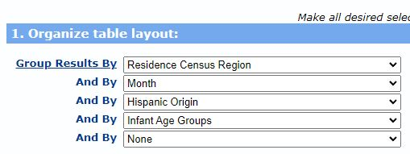

```{r setup, include=FALSE}
knitr::opts_chunk$set(echo = TRUE, warning = FALSE)
options(tidyverse.quiet = TRUE)

library(tidyverse)
```

## Inspiration


"By the same token, in 2018 and 2019 drug overdose deaths in the United States finally stopped increasing and there was at least some reason for optimism that we might be turning the corner on the opioid epidemic. But then in 2020 and (so far) 2021, overdoses have been surging again."

https://www.slowboring.com/p/all-kinds-of-bad-behavior-is-on-the

## CDC Wonder

- Wide-ranging OnLine Data for Epidemiologic Research (WONDER)
- Frequently updated datasets
- CDC Wonder query system allows dynamic queries with multiple aggregation options.
- Open and free datasets

https://wonder.cdc.gov/

## CDC Wonder Mortality Data


## Download data




## Load Data

```{r load_data}
library(tidyverse)

d <-
  read_delim(
    "Provisional Mortality Statistics, 2018 through Last Month (7).txt",
    delim = "\t",
    escape_double = FALSE,
    trim_ws = TRUE,
    n_max = 32,
    show_col_types = FALSE
  )

  knitr::kable(head(d), format="html")
```


## Plot attempt 1

```{r fig1, fig.width=10}

library(ggplot2)
library(hrbrthemes)

d %>%
  group_by(Year) %>%
  summarize(deaths = sum(as.numeric(Deaths))) %>%
  ggplot(aes(x=Year, y=deaths, fill="1")) +
  geom_col() +
  geom_text(aes(label = deaths), vjust = -0.5) +
  scale_fill_ft() +
  theme_ipsum() +
  theme(legend.position="none") +
  labs(title = "Unintentional drug overdose - NCHC Provisional 2018-2021",
       subtitle = "Total Deaths",
       caption = "Chart: Victor Castro for PHTH 6410 | Source: CDC")

```


## Plot attempt 2

```{r fig2, fig.width=10}

d %>%
  group_by(Year) %>%
  summarize(deaths = sum(as.numeric(Deaths)), .group="drop") %>%
  mutate(pct_change = (deaths-lag(deaths))/lag(deaths)) %>% 
  ggplot(aes(x=Year, y=pct_change, fill="1")) +
  geom_col() +
  geom_text(aes(label = scales::label_percent()(pct_change)), vjust = -0.5) +
  scale_fill_ft() +
  theme_ipsum() +
  theme(legend.position="none") +
  labs(title = "Unintentional drug overdose - NCHC Provisional 2018-2021",
       subtitle = "Percent change from previous year",
       caption = "Chart: Victor Castro for PHTH 6410 | Source: CDC")

```

## Plot attempt 3

```{r fig3, fig.width=10}

d %>%
  group_by(Year, `Residence Census Region`) %>%
  summarize(deaths = sum(as.numeric(Deaths)), .groups = "drop") %>%
  ggplot(aes(x=Year, y=deaths, fill="1")) +
  geom_col() +
  geom_text(aes(label = deaths), vjust = -0.5) +
  facet_wrap(~`Residence Census Region`) +
  scale_fill_ft() +
  theme_ipsum() +
  theme(legend.position="none") +
  labs(title = "Unintentional drug overdose - NCHC Provisional 2018-2021",
       subtitle = "Total deaths",
       caption = "Chart: Victor Castro for PHTH 6410 | Source: CDC")

```
## Conclusion

- CDC Wonder has many open datasets and powerful system to generate datasets.
- Reproducing results is hard.
